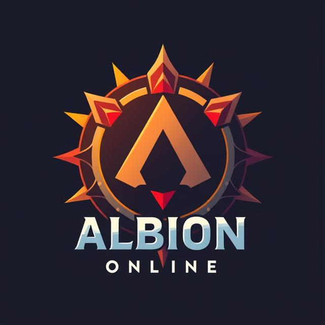

<p align="center">
  
</p>

# Discord - Albion Online Objectives

A Discord bot built for **Albion Online** players to track time-limited objectives — nodes, cores, and vortexes — with countdown timers, automatic cleanup, and multi-server support.

**Tech Stack:** Node.js 24 · TypeScript 5.9 · Sapphire Framework · Discord.js 14 · PostgreSQL · Sequelize 7

## How to Use

### 1. Invite the Bot

Add the bot to your Discord server using the [invite link](https://discord.com/oauth2/authorize?client_id=1401556946435440872). You need the **Manage Server** permission on the target server to authorize the bot.

### 2. Configure Bot Permissions

The bot needs the following permissions **in each channel** where you want it to operate. You can configure these via *Server Settings → Channels → Edit Channel → Permissions*:

| Permission | Why |
|------------|-----|
| **View Channel** | Access the channel |
| **Send Messages** | Post objective lists and updates |
| **Read Message History** | Find and clean up its own previous messages |
| **Manage Messages** | Delete its own outdated messages during auto-refresh |

> Without these permissions, the bot may fail silently — slash commands will work, but objective lists won't display or refresh properly.

### 3. User Permissions

Slash commands are available to **all server members** who can see the channel. No special role is required to use `/add` or `/list`.

For `/remove`, you can delete an objective if **any** of these conditions apply:
- You are the one who originally added it
- You have the **Manage Messages** permission in the channel
- You have the **Administrator** permission on the server

### 4. Start Tracking

Use the slash commands described below to add and manage objectives.

## Features

- `/add` — Add an objective with its type, rarity, map (270+ maps with autocomplete), and time remaining (`hh:mm` format). Includes duplicate prevention and automatic maintenance flag detection.
- `/list` — Display all current objectives organized by category (Nodes, Cores, Vortexes) with Discord timestamps.
- `/remove` — Remove an objective by its index number. Requires Admin, Manage Messages, or being the original poster.
- **Auto-cleanup** — Expired objectives are automatically removed every 30 minutes and messages are refreshed.
- **Multi-server** — Each server's data is fully isolated.

### Objective Types

| Category | Types | Rarities |
|----------|-------|----------|
| Nodes | Fiber, Hide, Ore, Wood | 4.4, 5.4, 6.4, 7.4, 8.4 |
| Cores | Core | Green, Blue, Purple, Gold |
| Vortexes | Vortex | Green, Blue, Purple, Gold |

## Self-Hosting

### Prerequisites

- **Node.js** 24+
- **pnpm** (package manager)
- **PostgreSQL** 15+

### Setup

Clone the repository:

```bash
git clone https://github.com/AnTSaSk/discord-aoo-bot.git
cd discord-aoo-bot
pnpm install
```

Copy `.env.example` to `.env.dev` and fill in your credentials (see [Environment Variables](#environment-variables) below):

```bash
cp .env.example .env.dev
```

Then:

```bash
# Optional — force-sync the database schema (destructive, drops existing tables)
pnpm run sync-db

# Start in development mode
pnpm run dev
```

Other available commands:

```bash
pnpm run build    # Compile TypeScript (tsc + tsc-alias)
pnpm run start    # Run compiled app in production mode
```

### Environment Variables

| Variable | Required | Description | Default |
|----------|----------|-------------|---------|
| `APP_BOT_TOKEN` | Yes | Discord Bot Token | — |
| `APP_CLIENT_ID` | Yes | Discord Application ID | — |
| `APP_DB_NAME` | Yes | PostgreSQL database name | — |
| `APP_DB_USER` | Yes | PostgreSQL user | — |
| `APP_DB_PASSWORD` | Yes | PostgreSQL password | — |
| `APP_DB_HOST` | No | PostgreSQL host | `localhost` |
| `APP_DB_PORT` | No | PostgreSQL port | `5432` |
| `APP_LOGTAIL_TOKEN` | No | Logtail token for production logging | — |
| `APP_LOGTAIL_ENDPOINT` | No | Logtail endpoint URL | — |
| `APP_DEV_MODE` | No | Enable pretty-printed logs | `false` |
| `APP_LOG_LEVEL` | No | Log level: `trace`, `debug`, `info`, `warn`, `error`, `fatal` | `debug` in dev, `info` in prod |

## Contributing

Contributions are welcome! Here's how to get started:

1. [Fork](https://help.github.com/articles/fork-a-repo/) the project on GitHub and clone your fork locally:

   ```bash
   git clone https://github.com/<your-username>/discord-aoo-bot.git
   cd discord-aoo-bot
   git remote add upstream https://github.com/AnTSaSk/discord-aoo-bot.git
   ```

2. Make sure your local `main` branch is up to date before branching off:

   ```bash
   git checkout main
   git pull upstream main
   ```

3. Create a new branch for your contribution:

   ```bash
   git checkout -b feature/my-feature
   ```

4. Implement your changes. The project uses **ESLint strict** and **TypeScript strict** mode — follow the existing code style and conventions.

5. Make sure the project builds cleanly:

   ```bash
   pnpm run build
   ```

6. Write your commit messages in the present tense (e.g. "Add map filter" not "Added map filter"). Keep them concise and descriptive.

7. Push your branch to your fork:

   ```bash
   git push origin feature/my-feature
   ```

8. [Open a Pull Request](https://help.github.com/articles/about-pull-requests/) against the `main` branch of the upstream repository. Describe what your changes do and why.

9. If the maintainer requests changes, push additional commits to your branch — the PR will update automatically.

## Support

For support, join our [Discord server](https://discord.gg/P4dmPCKnrY).

## Support the Project

If you find this bot useful, consider buying me a coffee:

[](https://ko-fi.com/H2H012GY4I)

## License

GNU General Public License v3.0 or later

See [COPYING](COPYING) to see the full text.
